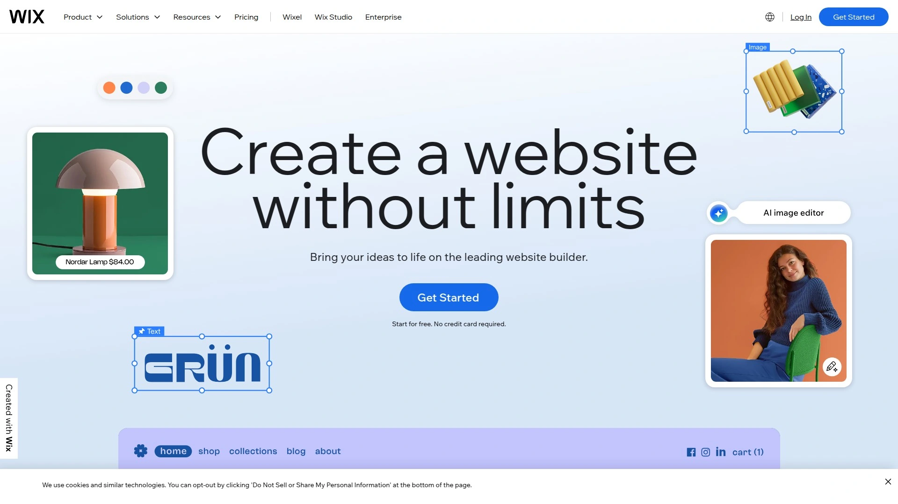
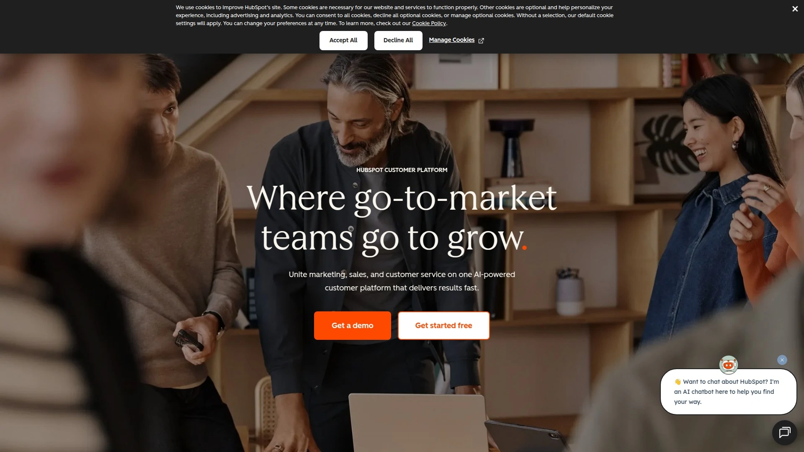

# 学会使用这15个AI建站工具,五分钟搞定网站上线

你有个创业点子,想尽快做个网站测试市场反应,但一想到要找设计师、写代码、买服务器,头就大了。或者你需要给新产品做个落地页收集用户邮箱,可预算有限又等不起外包团队慢吞吞的交付节奏。现在有个更聪明的办法——AI建站工具。只需要用一句话描述你的想法,AI就能在几十秒内帮你生成一个完整网站,包括布局、文案、图片,全都配好。这篇文章整理了15个实战中最好用的平台,覆盖创业落地页、企业官网、在线商店等各种场景,让你快速上线测试想法。

## **[Mixo](https://www.mixo.io)**

用一句话描述想法,几秒钟生成完整的创业网站和邮件订阅系统。

Mixo特别适合想要快速验证创意的创业者。你只需要输入一段简短的产品描述,比如"一个帮助远程团队管理项目的协作工具",AI就会立刻生成一个包含标题、介绍、功能说明和订阅表单的完整落地页。整个过程不超过一分钟,生成的网站自动适配手机和电脑,样式现代简洁。

最实用的是它内置了邮件订阅管理功能,访客留下邮箱后你可以直接在后台看到数据,还能发送调研问卷或者邀请用户参与测试。对于还在验证阶段的产品来说,这个功能省去了单独配置邮件工具的麻烦。平台已经帮超过75万创作者生成了300多万个网站,覆盖300多个行业。提供免费试用,付费版从每月9美元起,包含自定义域名、更多设计选项和数据分析功能。

## **[Wix AI](https://www.wix.com)**

2025年功能最全面的AI建站平台,提供从生成到运营的完整工具链。

Wix的AI建站功能已经打磨了快10年,技术成熟度很高。你可以选择跟AI聊天的方式建站,告诉它你的业务类型、风格偏好,它会提供几套设计方案让你选择。选定之后,Wix会根据它能找到的你的社交媒体信息或者公开资料,自动填充Logo、联系方式这些内容,大幅减少手工录入的时间。

除了基础建站,Wix还提供了一整套AI工具:AI文案助手帮你改写和优化网页文字,AI图片生成器能根据描述创作配图,AI布局建议让你快速调整页面结构。如果你要做电商网站,它还内置了库存管理、支付接口、物流跟踪这些功能。免费版可以搭建基础网站,付费版从每月17美元起,适合需要更多存储空间和去除广告的用户。

## **[Framer](https://www.framer.com)**

设计师最爱的AI建站工具,生成高质感网页和自定义动画效果。

Framer的定位偏向专业设计领域,它生成的网站视觉效果特别精致,很适合需要展示作品集或者注重品牌形象的团队。输入需求后,AI会生成包含布局、文案、样式的响应式网页,每个页面的设计都是独特组合,不会跟其他网站撞款。你可以随时切换字体、配色方案、页面布局,调整起来非常灵活。

Framer支持自定义动画和交互效果,不需要写代码就能做出鼠标悬停、页面滚动触发的动态效果,这在其他工具里比较少见。它还内置了内容管理系统和多语言本地化功能,方便团队协作和面向不同地区的用户。平台提供免费域名和模板,付费计划从每月5美元起,但完整功能需要更高级别的订阅,价格相对其他工具偏高。

## **[Durable AI](https://durable.co)**

30秒生成小企业网站,配齐CRM和发票系统的一站式方案。

Durable的口号是"最快的AI建站工具",实测下来确实速度惊人。只需要告诉它你的行业和公司名称,30秒内就能拿到一个包含首页、服务介绍、联系表单的完整网站。它生成的设计比较直接,没有太多花哨元素,但该有的都有,很适合本地服务商、咨询公司这类需要快速上线展示业务的小企业。

更有意思的是Durable不止做建站,它还配套了客户关系管理工具、AI助手、发票开具系统,相当于给小企业提供了一套轻量级的业务管理软件。如果你是个体户或者小团队,用一个平台就能搞定网站、客户跟进、收款这些事。定价从每月12美元起,包含网站托管和所有业务工具。

## **[10Web AI](https://10web.io)**

基于WordPress的AI建站平台,能复制任何网站的设计并自动优化加载速度。

10Web特别适合想用WordPress但又不想从零开始的人。它最独特的功能是可以输入任意网站的URL,AI就会分析那个网站的设计和功能,然后在WordPress上重建一个类似的版本。这对接客户的设计师或者代理商特别实用——客户说"我想要个像XX网站那样的",你直接粘贴链接就能快速做出原型。

生成的WordPress网站会自动优化到PageSpeed得分90+,这对SEO和用户体验都是大加分项。平台还提供一键迁移功能,可以把现有网站从其他CMS平台搬到10Web托管,整个过程不需要手动复制代码。免费版功能有限,付费从每月10美元起,包含托管、自动备份和安全防护。

## **[Hostinger AI](https://www.hostinger.com)**

价格最友好的AI建站工具,月费不到2美元就能获得完整功能。

Hostinger本来是个老牌主机商,这两年加入了AI建站功能后性价比变得特别突出。它的AI生成器操作简单,描述需求后不到一分钟就能拿到网站,支持博客、企业站、个人作品集等多种类型。生成的网站自带托管服务,不需要再单独买服务器配置域名。

Hostinger的优势在于把建站和托管打包卖,价格压得很低。基础套餐每月1.99美元起,已经包含了AI建站工具、免费域名、SSL证书、邮箱账号这些东西,对预算紧的个人和小团队非常友好。网站加载速度也不错,后台界面简洁易懂,新手上手没压力。

## **[Squarespace Blueprint AI](https://www.squarespace.com)**

创意行业首选,生成高品质模板并自带精美设计元素。

Squarespace一直以模板设计精美著称,它的AI建站功能延续了这个优点。Blueprint AI会问你几个问题——业务类型、风格偏好、想要的页面——然后生成一个高度定制化的网站,配色、字体、图片都搭配得很协调。生成的网站质感很好,特别适合摄影师、设计师、艺术家这些需要展示视觉作品的职业。

除了建站,Squarespace还提供AI文案生成器、邮件营销工具、预约系统、电商功能,基本覆盖了创意工作者需要的所有线上工具。它的AI还能生成品牌标识,帮你统一整个网站的语言风格。提供14天免费试用,付费从每月16美元起,年付有九折优惠。

## **[Dorik](https://dorik.com)**

支持任意语言生成内容,还能用AI创作网站配图。

Dorik的特色是它的AI能生成任意语言的网站内容,这在其他工具里比较少见。如果你需要做多语言网站或者目标市场不是英语地区,Dorik能帮你省掉翻译的麻烦。它还内置了AI图片生成器,根据一句话描述就能创作插画或照片,不需要去找素材网站。

生成网站的速度也很快,输入业务描述后几秒钟就能实时看到网站成型。生成的设计风格偏现代,色彩鲜艳,虽然整体协调性有时需要手动调整,但它的快速风格切换功能让改版变得很方便。如果不满意可以重新生成,提供更详细的指令后效果会更精准。定价从免费版起步,付费版每月15美元。

## **[GoDaddy AI](https://www.godaddy.com)**

最快速度建站,几分钟内从零到上线发布。

GoDaddy的AI建站工具主打速度,适合需要立刻上线的紧急场景。它简化了所有流程,只问最核心的几个问题,然后快速生成一个简洁实用的网站。虽然设计选项不如其他平台丰富,但胜在效率高,从注册账号到网站发布全程不超过10分钟。

GoDaddy本身就是域名注册商,所以在它这里建站的好处是域名、托管、邮箱可以一起搞定,不用在多个平台之间跳来跳去。对于完全不懂技术、只想快速有个网络门面的小企业老板来说,GoDaddy是个省心选择。定价从每月9.99美元起,包含基础建站和托管服务。

## **[Instapage](https://instapage.com)**

落地页转化率优化专家,内置AB测试和协作功能。

Instapage专注于营销落地页场景,它的AI能根据广告组和受众自动生成标题、正文、行动号召按钮。如果你在跑付费广告,需要针对不同人群创建多个版本的落地页,Instapage能大幅提高效率。它提供500多个经过转化率测试的模板,可以复用的模块让你快速扩展页面数量。

平台内置了AB测试工具和深度分析功能,能追踪每个元素对转化率的影响。团队协作功能也很完善,多人可以同时编辑和审批页面,比较适合营销团队使用。完全无代码操作,不管技术背景如何都能上手。提供14天免费试用,付费从每月99美元起,定位偏向专业营销人员。

## **[Unbounce](https://unbounce.com)**

AI辅助的落地页构建平台,专注提升营销活动转化效果。

Unbounce和Instapage有点类似,都是专攻营销落地页的工具。它的AI功能包括智能文案建议、自动化流量分配、转化率预测等。平台会分析你的页面内容,给出优化建议,比如哪个标题可能表现更好、按钮放哪里更容易被点击。

它的智能流量分配功能很有意思,会自动把访客引导到最可能让他们转化的页面版本,不需要你手动设置AB测试规则。对于需要同时运行多个广告活动的营销人员来说,这个功能能省不少时间。定价从每月90美元起,适合预算充足、注重转化效果的企业。

## **[B12](https://www.b12.io)**

AI生成+设计师润色的混合模式,提供专业服务行业网站方案。

B12的特别之处在于它不是纯AI生成,而是AI做初稿、人类设计师做优化的混合模式。你先用AI快速生成一个网站,然后可以选择让B12的设计团队进行专业润色。这种方式结合了AI的速度和人类的审美判断,最终网站质量比纯AI更精致。

B12特别针对律师、会计师、咨询顾问这些专业服务行业,提供了预约系统、客户门户、在线支付等功能。如果你不想要千篇一律的AI模板,又不想花大价钱请设计公司,B12是个折中方案。基础版免费,带设计师服务的套餐从每月49美元起。

## **[HubSpot AI](https://www.hubspot.com)**

营销自动化巨头推出的免费AI建站工具,无缝对接CRM系统。

HubSpot做营销工具起家,它的AI建站器最大优势是跟HubSpot的CRM、邮件营销、客户跟踪系统无缝连接。如果你已经在用HubSpot管理客户数据,那用它的AI建站功能就能把网站访客自动录入系统,追踪每个潜在客户的行为路径。

建站过程很简单,回答几个问题就能生成网站,不需要信用卡就能使用基础功能。虽然设计选项相对有限,但对于B2B企业来说,能跟营销自动化工具打通比网站好看更重要。HubSpot的生态系统很完善,如果你需要整套数字营销方案,从这里起步是个合理选择。

## **[Carrd](https://carrd.co)**

最佳免费单页网站工具,适合个人介绍和链接聚合页。

Carrd专注于单页网站,特别适合做个人介绍页、作品集展示、社交媒体链接聚合这类简单场景。它的免费版功能已经很完整,可以创建多个网站,只是会带个小广告和使用子域名。操作特别简单,选个模板、改改文字和图片就能发布。

虽然是单页网站,但Carrd支持的元素很丰富,可以加文本、图片、视频、表单、嵌入代码,还能设置动画效果。付费版每年19美元起,能移除广告、绑定自定义域名、添加更多功能。对于只需要一个简单在线名片或者链接导航页的人来说,Carrd是最高效的选择。

## **[Jimdo](https://www.jimdo.com)**

德国老牌建站工具,AI功能完善且提供免费版本。

Jimdo是欧洲很受欢迎的建站平台,在隐私保护和数据安全方面做得很好,符合GDPR标准。它的AI建站功能问几个问题后就能生成网站,整个流程很流畅。生成的网站风格偏向简洁商务,适合中小企业和个体经营者。

Jimdo提供慷慨的免费版,可以创建基础网站并获得子域名。付费版从每月9欧元起,包含自定义域名、去广告、更多存储空间。它的SEO工具做得不错,能帮你优化搜索引擎排名。如果你重视数据隐私,或者业务面向欧洲市场,Jimdo是个值得考虑的平台。

---

## 常见问题

**这些AI建站工具真的不需要懂代码吗?**

完全不需要。这些平台都是可视化操作,输入内容、拖拽元素、点击发布,整个过程跟用Word差不多。像Mixo、Durable、GoDaddy这些更是把流程简化到只需要回答几个问题,AI就自动完成网站搭建。即使你从没做过网站,跟着提示走也能在10分钟内上线一个可用的站点。

**用AI生成的网站质量如何,会不会都长一个样?**

质量取决于平台的算法水平。像Wix、Framer、Squarespace这些成熟平台生成的网站,设计协调性和专业度已经很高,甚至能达到专业设计师的中等水平。至于重复度问题,虽然用的是模板系统,但AI会根据你的行业、内容、偏好做定制化组合,只要你稍微修改一下颜色、字体、图片,基本不会撞款。

**免费版够用吗,什么情况需要升级付费?**

如果只是测试想法或者做个简单的个人页面,Carrd、Jimdo、HubSpot的免费版完全够用。但免费版通常会有广告、子域名、功能限制。当你需要绑定自己的域名、去掉平台广告、使用电商功能、连接第三方工具时,就需要升级付费版。大部分平台的入门价格在每月10到20美元之间,年付通常有折扣。

---

## 总结

如果你是创业者想快速验证想法,[Mixo](https://www.mixo.io)是最直接的选择——一句话生成网站,内置邮件订阅系统,几分钟就能开始收集潜在用户反馈。这15个工具各有侧重,需要设计感选Framer或Squarespace,要省钱选Hostinger或Carrd,做营销落地页找Instapage或Unbounce,WordPress用户直接上10Web。找对工具,你的网站从想法到上线真的只需要一杯咖啡的时间。
